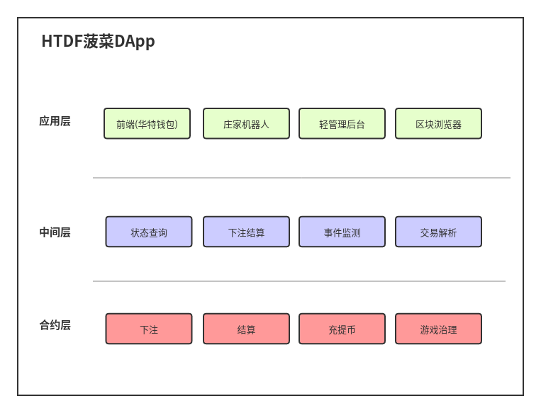

# HTDF




geth的console发送交易

```
eth.sendTransaction({'from':eth.accounts[0], 'to': "0x954d1a58c7abd4ac8ebe05f59191Cf718eb0cB89", 'value': web3.toWei(100, "ether")})
```


# 使用solidity v0.8.0时, 需要修改 evm 指令集

需要修改 `core/vm/interpreter.go`, 将 berlin指令集作为默认的指令集

```go

// NewEVMInterpreter returns a new instance of the Interpreter.
func NewEVMInterpreter(evm *EVM, cfg Config) *EVMInterpreter {
	// We use the STOP instruction whether to see
	// the jump table was initialised. If it was not
	// we'll set the default jump table.
	if cfg.JumpTable[STOP] == nil {
		var jt JumpTable
		// switch {
		// case evm.chainRules.IsBerlin:
		// 	jt = berlinInstructionSet
		// case evm.chainRules.IsIstanbul:
		// 	jt = istanbulInstructionSet
		// case evm.chainRules.IsConstantinople:
		// 	jt = constantinopleInstructionSet
		// case evm.chainRules.IsByzantium:
		// 	jt = byzantiumInstructionSet
		// case evm.chainRules.IsEIP158:
		// 	jt = spuriousDragonInstructionSet
		// case evm.chainRules.IsEIP150:
		// 	jt = tangerineWhistleInstructionSet
		// case evm.chainRules.IsHomestead:
		// 	jt = homesteadInstructionSet
		// default:
		// 	jt = frontierInstructionSet
		// }

		// yqq , 2021-04-13 , we use berlin as default instructionSet
		jt = berlinInstructionSet
```